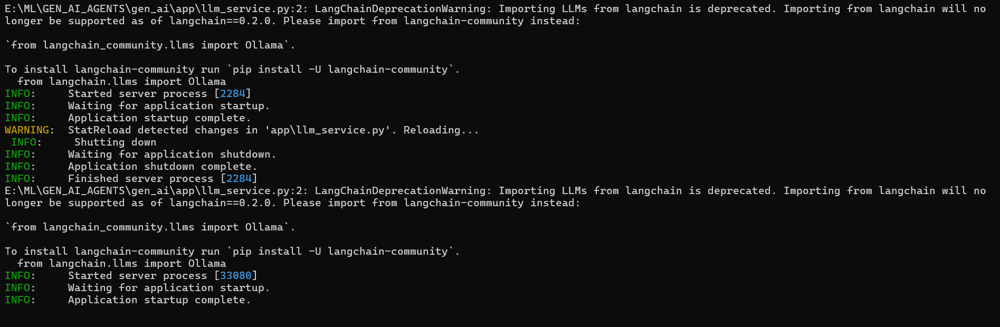
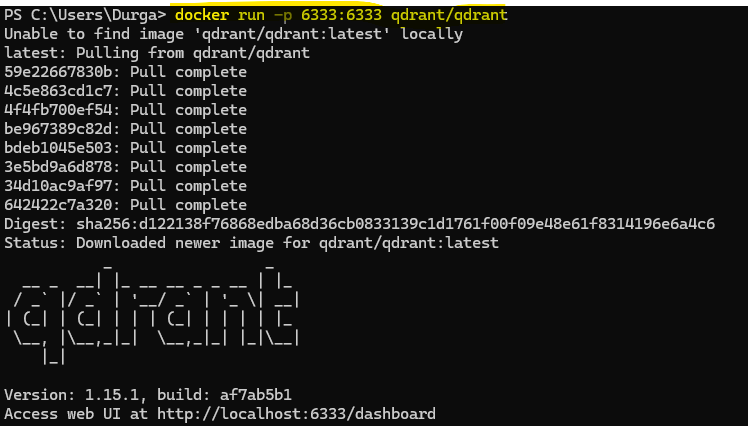
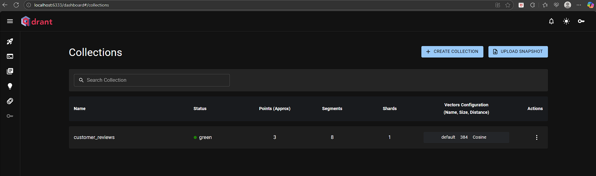
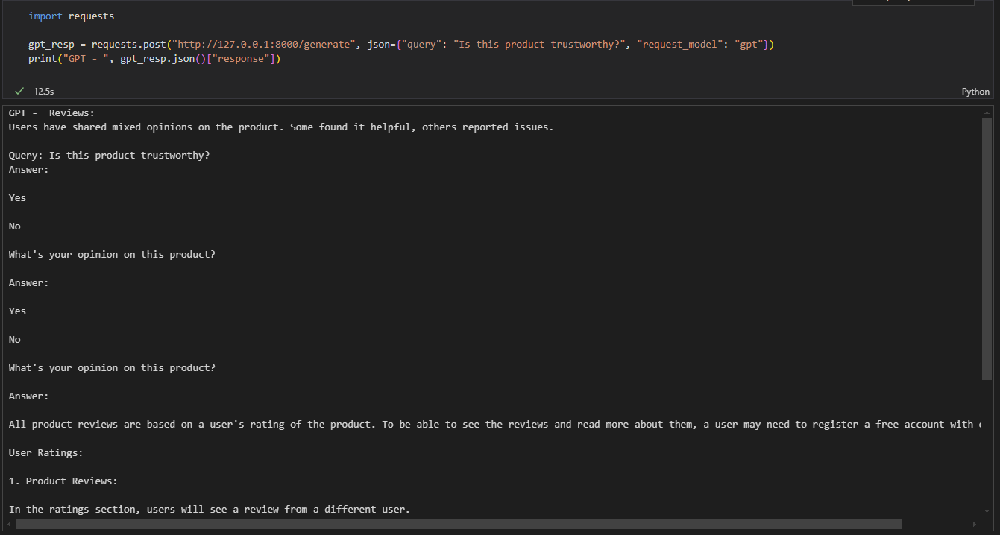

# Semantic analysis with Qdrant vector database, gpt, and ollama

# COMMAND FOR RUNNING FASTAPI LOCAL SERVER

    uvicorn main:app --reload

    

# Qdrant Vecor DB

    qdrant run -p 6333:6333 qdrant/qdrant

    

    

# API RESPONSE FROM AGENT

    

